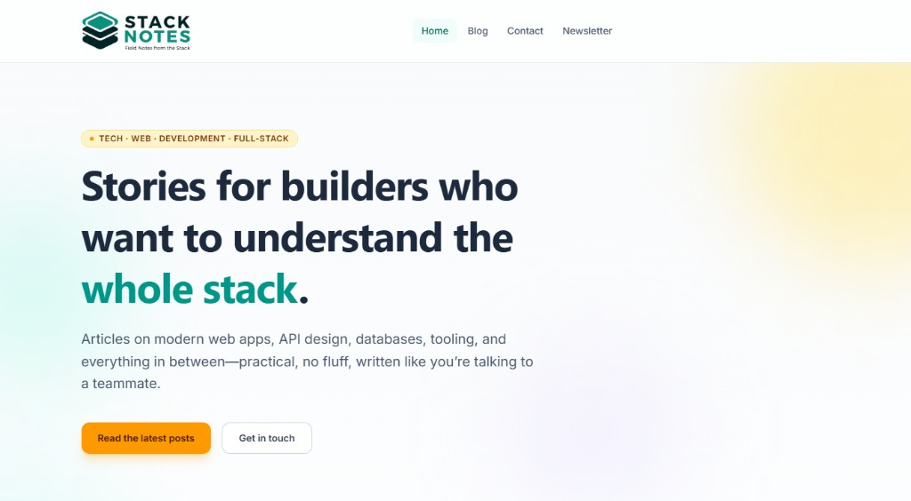

# Stack Notes (demo)

A small **marketing-style** Laravel application built with **Inertia.js** and **Vue 3**. It showcases a fictional product site called “Stack Notes” with a welcome page, sample blog posts, contact and legal pages, and a newsletter signup flow backed by the database.

> **This is a fake / test website.** It is not a real product or service. Placeholder copy, emails, and social links are for demonstration and learning only. Do not treat any of it as official or production-ready without your own review and hardening.

## Preview

The images below are normal Markdown (not inside a code block), so they should render on GitHub and in most editor previews. Open the files directly if they do not show.

- [Home page screenshot](./docs/screenshots/homepage.png)
- [Home page (footer) screenshot](./docs/screenshots/homepage-footer.png)
- [Filament dashboard screenshot](./docs/screenshots/dashboard.png)

*Click the image to open it on GitHub (larger view / download).*

## Tech stack

- **Backend:** PHP 8.3, Laravel 13
- **Frontend:** Vue 3, TypeScript, Inertia.js v2, Vite 8, Tailwind CSS v4
- **Routing in the frontend:** [Laravel Wayfinder](https://github.com/laravel/wayfinder) (generated route helpers)
- **Tests:** Pest 4
- **Admin:** Filament v5 (panel separate from the marketing site)
- **Local environment (optional):** Laravel Sail (Docker) with MySQL 8 and **Mailpit** (SMTP capture for development)

## What’s included

- Marketing layout (header, footer) and a home page with featured content
- Sample blog index and post pages (static sample data, not a full CMS)
- Contact page (form UI only; not wired to mail by default)
- **Newsletter:** `newsletter_subscribers` in the database, double opt-in (confirmation link with expiry), welcome email after confirm, unsubscribe links in sent mail, resend-confirmation page, throttling + honeypot on public forms; `newsletter:send` command + monthly schedule for a sample issue email to confirmed subscribers
- Legal-style pages (privacy, terms, cookies)—aligned with the newsletter behavior but still **not** legal advice; replace with your own counsel-reviewed text for production
- **Filament admin panel** — see [Admin panel (Filament)](#admin-panel-filament) below. The marketing site does **not** expose sign-in, registration, or password-reset pages; those Inertia routes were removed in favor of the panel login.
- **SEO / OpenGraph / Twitter / JSON-LD** — see [SEO](#seo) below. Site-wide defaults, per-blog-post overrides editable in Filament, `sitemap.xml`, and `robots.txt`.
- **Blog category & tag archives** — `/blog/category/{slug}` and `/blog/tag/{slug}` list every published, indexable post in that taxonomy. Category and tag chips on the homepage and blog list link to the matching archive.
- **Pagination** — the blog index and category/tag archives paginate at `BlogPost::PUBLIC_PER_PAGE` (default 10) per page via `?page=N`. Each page is a unique, self-canonical URL with prev/next links.
- **Related posts on blog show** — each post renders up to two rails below the body: **More in {Category}** (3 newest siblings) and **Tagged with {tag1, tag2}** (3 newest posts sharing at least one tag, deduped against the category rail). Either rail auto-hides when there are no matches, and the whole section is omitted for posts that are alone in their category and untagged. Excludes drafts and `noindex` posts.

### Admin panel (Filament)

The admin UI is **not** part of the Inertia marketing app. It lives under:

| URL | Purpose |
| --- | --- |
| `/dashboard` | Filament dashboard (after login) |
| `/dashboard/login` | Filament sign-in |

**Access control:** Only one email is allowed. Set `FILAMENT_ADMIN_EMAIL` in `.env` to that address. The `users` row you log in with must use the **same** email, or you will get **403** after authentication (`App\Models\User::canAccessPanel()`).

**Create the admin user** (after migrations), matching `FILAMENT_ADMIN_EMAIL`:

```bash
# With Sail (recommended here; PHP in the container includes ext-intl)
./vendor/bin/sail artisan make:filament-user --panel=dashboard
```

Interactive prompts are easiest. For scripts or CI you can pass `--name`, `--email`, `--password` (min. 8 characters) and `--no-interaction`.

Without Sail, use `php artisan make:filament-user` instead—your PHP install must include the **intl** extension (Filament requires it).

**Theming:** The panel uses a custom Vite theme at `resources/css/filament/admin/theme.css` (Stack Notes branding, teal primary, heading font). It is listed in `vite.config.ts`; run `npm run build` (or `npm run dev`) so assets stay in sync.

**Wayfinder:** Backend route changes can require regenerating TypeScript helpers: `php artisan wayfinder:generate`.

## SEO

Site-wide SEO defaults live in `config/seo.php` (driven by `SEO_*` env keys in `.env.example`). They are shared with every Inertia page through `HandleInertiaRequests` as `seoDefaults`. Controllers can override per page via a `seo` prop built with `App\Support\Seo\SeoPayload::make([...])`.

- Every marketing page renders meta tags, OpenGraph, Twitter cards, and an optional JSON-LD block through `resources/js/components/SeoHead.vue`.
- Blog posts get per-post overrides in the Filament **SEO** section (meta title, meta description, social share image, `noindex`). Empty fields fall back to the post title and excerpt automatically.
- The homepage emits `WebSite` JSON-LD; the blog index emits `Blog` JSON-LD; each blog post emits `Article` JSON-LD with publisher, section, and tags; category and tag archives emit `CollectionPage` + `ItemList` JSON-LD with a `BreadcrumbList`.
- `GET /sitemap.xml` (route name `sitemap`) includes the home, blog index, contact, newsletter, legal pages, every **published, indexable** blog post, and every category/tag archive that has at least one such post.
- `GET /robots.txt` (route name `robots`) disallows `/dashboard*` and newsletter confirm/unsubscribe/resend paths, and points crawlers at the sitemap.

## Requirements

- PHP 8.3+ and [Composer](https://getcomposer.org/) if you run the app **without** Sail
- [Node.js](https://nodejs.org/) and npm for the frontend build
- **Or** [Docker](https://www.docker.com/) for Sail-based development (recommended if your host PHP lacks the MySQL driver)

## Getting started

### With Laravel Sail (recommended when using MySQL in Docker)

From the project root:

```bash
cp .env.example .env
composer install
./vendor/bin/sail up -d   # or: make up
./vendor/bin/sail artisan key:generate
./vendor/bin/sail npm install
make migrate              # runs sail artisan migrate — see Makefile
./vendor/bin/sail npm run dev
```

Open the URL from `APP_URL` in your `.env` (often `http://localhost`).

#### Local email with Sail (Mailpit)

Outbound mail is queued in the app. To see confirmation and other messages during development:

1. Configure **`MAIL_*`** for Mailpit (see comments in `.env.example`; the compose file exposes SMTP on `mailpit:1025`).
2. Run a queue worker, e.g. `./vendor/bin/sail artisan queue:work` (or `make artisan ARGS="queue:work"`).
3. Open the **Mailpit** web UI—typically `http://localhost:8025` unless you changed `FORWARD_MAILPIT_PORT`.

### Without Sail

Use a PHP build with **pdo_mysql** (or switch `DB_CONNECTION` to `sqlite` in `.env` for local experiments), then:

```bash
composer install
cp .env.example .env
php artisan key:generate
npm install
php artisan migrate
npm run dev
# In another terminal, if needed:
php artisan serve
```

## Scripts and Makefile

- `npm run dev` / `npm run build` — Vite frontend
- `php artisan test` — run the full test suite (uses SQLite in memory in `phpunit.xml`)
- `**make migrate**` — runs migrations **inside** Sail (avoids “could not find driver” when your host PHP has no MySQL extension)
- `make artisan ARGS="queue:work"` — process queued mail/jobs (needed locally if `QUEUE_CONNECTION` is `database` and you want emails to send)
- Run `make help` for other Sail shortcuts

**Scheduling:** the app registers a monthly `newsletter:send` task. In production you still need the OS/cron entry to run `php artisan schedule:run` every minute (see Laravel docs); Sail does not run the scheduler unless you invoke it yourself.

## Tests

```bash
php artisan test --compact
```

## Adding more README images (optional)

Put files under `docs/screenshots/`.

**Why you might “not see” an image:** anything between triple backticks (a fenced code block) is shown as **plain text**, not rendered. The example below is only source code to copy—paste it **outside** of a code block if you want a real picture.

Plain image (not clickable on GitHub):

```markdown

```

The outer `[...](url)` is the link; the inner `` is the image.

## License

Released under the MIT License (see `composer.json`).