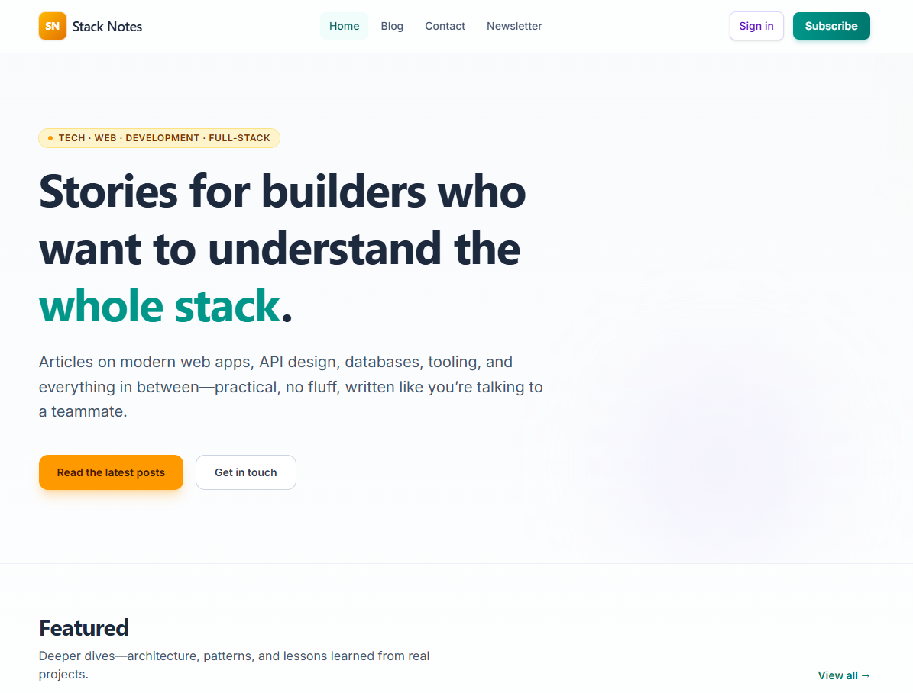

# Stack Notes (demo)

A small **marketing-style** Laravel application built with **Inertia.js** and **Vue 3**. It showcases a fictional product site called “Stack Notes” with a welcome page, sample blog posts, contact and legal pages, and a newsletter signup flow backed by the database.

> **This is a fake / test website.** It is not a real product or service. Placeholder copy, emails, and social links are for demonstration and learning only. Do not treat any of it as official or production-ready without your own review and hardening.

## Preview

The image below is normal Markdown (not inside a code block), so it should render on GitHub and in most editor previews. [Open the file directly](./docs/screenshots/home.png) if it does not show.

[](./docs/screenshots/home.png)

_Click the image to open it on GitHub (larger view / download)._

## Tech stack

- **Backend:** PHP 8.3, Laravel 13
- **Frontend:** Vue 3, TypeScript, Inertia.js v2, Vite 8, Tailwind CSS v4
- **Routing in the frontend:** [Laravel Wayfinder](https://github.com/laravel/wayfinder) (generated route helpers)
- **Tests:** Pest 4
- **Local environment (optional):** Laravel Sail (Docker) with MySQL 8

## What’s included

- Marketing layout (header, footer) and a home page with featured content
- Sample blog index and post pages (static sample data, not a full CMS)
- Contact page (form UI only; not wired to mail by default)
- Newsletter page with validation and persistence (`newsletter_subscribers` table)
- Legal-style pages (privacy, terms, cookies) with placeholder legal text

## Requirements

- PHP 8.3+ and [Composer](https://getcomposer.org/) if you run the app **without** Sail
- [Node.js](https://nodejs.org/) and npm for the frontend build
- **Or** [Docker](https://www.docker.com/) for Sail-based development (recommended if your host PHP lacks the MySQL driver)

## Getting started

### With Laravel Sail (recommended when using MySQL in Docker)

From the project root:

```bash
cp .env.example .env
composer install
./vendor/bin/sail up -d   # or: make up
./vendor/bin/sail artisan key:generate
./vendor/bin/sail npm install
make migrate              # runs sail artisan migrate — see Makefile
./vendor/bin/sail npm run dev
```

Open the URL from `APP_URL` in your `.env` (often `http://localhost`).

### Without Sail

Use a PHP build with **pdo_mysql** (or switch `DB_CONNECTION` to `sqlite` in `.env` for local experiments), then:

```bash
composer install
cp .env.example .env
php artisan key:generate
npm install
php artisan migrate
npm run dev
# In another terminal, if needed:
php artisan serve
```

## Scripts and Makefile

- `npm run dev` / `npm run build` — Vite frontend
- `php artisan test` — run the full test suite (uses SQLite in memory in `phpunit.xml`)
- **`make migrate`** — runs migrations **inside** Sail (avoids “could not find driver” when your host PHP has no MySQL extension)
- Run `make help` for other Sail shortcuts

## Tests

```bash
php artisan test --compact
```

## Adding more README images (optional)

Put files under `docs/screenshots/`.

**Why you might “not see” an image:** anything between triple backticks (a fenced code block) is shown as **plain text**, not rendered. The example below is only source code to copy—paste it **outside** of a code block if you want a real picture.

Plain image (not clickable on GitHub):

```markdown

```

The outer `[...](url)` is the link; the inner `` is the image.

## License

Released under the MIT License (see `composer.json`).
